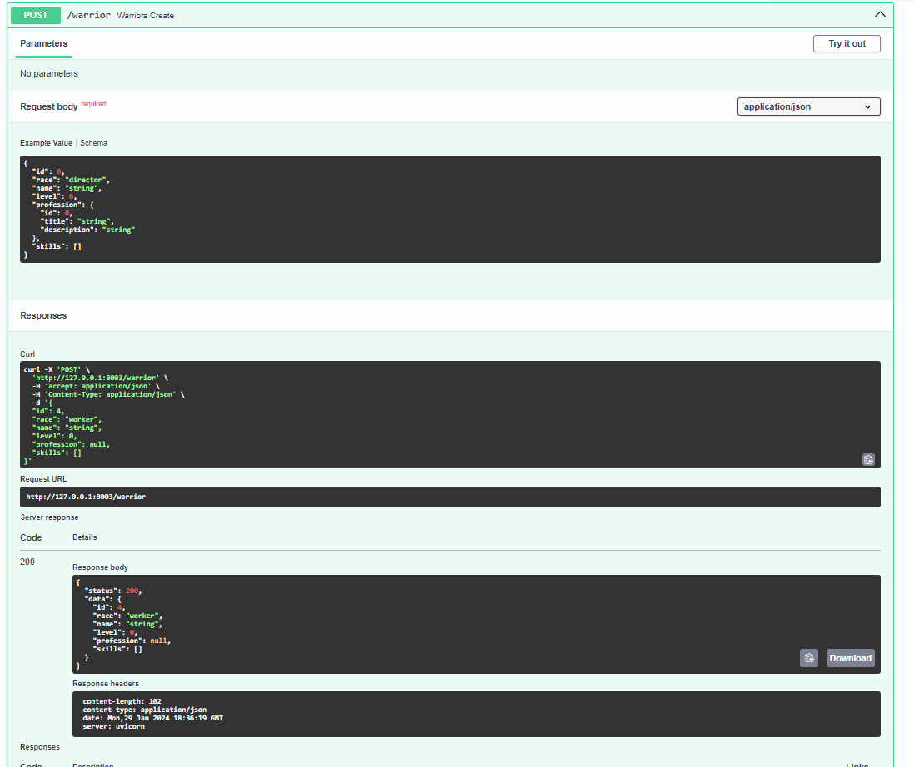

# Практика 2.1. Создание базового приложения на FastAPI

> **Для выполнения лабораторной и всех практических работ рекомендуется использовать версию Python 3.10+**

## Запуск

`FastAPI — это веб-фреймворк Python, предоставляющий реализацию быстрого и легкого современного API, который проще в
освоении по
сравнению с другими веб-фреймворками на основе Python, такими как Flask и
Django. FastAPI относительно новый, но его сообщество растет. Он широко используется при создании веб-API и
развертывании моделей машинного обучения.`

У FastAPI есть отличная [документация](https://fastapi.tiangolo.com/ru/) частично переведенная на множество языков (в
том числе и русский) с подробным описанием работы методов и различными советами по реализации типовых решений.
В ходе текста лабораторных и практических работ неоднократно будут появляться ссылки на документацию,
поясняющую используемые решения, методы и классы.

### Установка и запуск приложения

По сравнению с Django FastAPI не требует длительной установки и настройки приложения, чтобы его запустить достаточно
выполнить несколько простых операций:

* Создать новый проект в IDE, реализовать виртуальное окружение
* Установить FastApi с cопутствующими библиотеками написав в командной строке:

```
 pip install fastapi[all]
```

* Реализовать файл `main.py` в котором будет написан следующий код:

```py
from fastapi import FastAPI

app = FastAPI()


@app.get("/")
def hello():
    return "Hello, [username]!"

```

В этом коде реализуется класс [`FastAPI`](https://fastapi.tiangolo.com/reference/fastapi/)отвечающий за реализацию
сервера и возможность реализации методов представления. Обращаясь к созданному объекту посредством декоратора,
вызывается GET-метод `@app.get`, в который передается адрес эндпоинта. Под декоратором реализуется функция, возвращающее
текстовое значение.
!!! note "Замечание"
    `get` может возвращать любые значения имеющие метод __str__

* Для запуска реализованного приложения необходимо воспользоваться веб-сервером [uvicorn](https://www.uvicorn.org/),
  поддерживающим FastAPI.
  Запустить сервер можно написав команду:

```
uvicorn main:app --reload
```

`uvicorn` - команда для запуска сервера, `main:app` - название файла и переменной FastAPI, `--reload` - автоматически
перезапускает сервер при изменениях в коде приложения.

!!! note "Замечание"
    Если необходимо указать порт для запуска приложения, в параметрах указывается следующее значение: `--port [номер_порта]`

### Результат

1. По адресу  `127.0.0.1:8000` будет возвращаться значение, указанное для созданной get-функции

2. По адресу  `127.0.0.1:8000/docs` появится автоматически сгенерированная документация к коду 

!!! note "Замечание"
    Автогенерируемая документация очень удобна для тестирования и проверки АПИ, реализуемого в слеюущих разделах и 
    практиках.

## Методы и виртуальная БД

### Создание тестовой БД

_Для тестирования и реализации основных запросов необходимо создать временную БД, чтобы продемонстрировать возможность
API-взаимодействия внутри фреймворка. В качестве тестовой базы используется упрощенная модель Воинов, представленная в
прошлых лабораторных работах._

В файле `main.py` после объявления переменной приложения создадим набор данных в виде переменной:
??? abstract "Временная БД"
    ```py
    temp_bd = [{
        "id": 1,
        "race": "director",
        "name": "Мартынов Дмитрий",
        "level": 12,
        "profession": {
            "id": 1,
            "title": "Влиятельный человек",
            "description": "Эксперт по всем вопросам"
        },
    },
        {
            "id": 2,
            "race": "worker",
            "name": "Андрей Косякин",
            "level": 12,
            "profession": {
                "id": 1,
                "title": "Дельфист-гребец",
                "description": "Уважаемый сотрудник"
            },
        },
    ]
    
    ```

Из этой переменной будут браться данные для реализации базового CRUD-интерфейса.

### Создание АПИ-эндпоинтов

Для реализации CRUD-API в базовой имплементации приложения необходимо использовать специальные методы, описывающие
HTTP-запросы внутри веб-приложения. Все подобные методы вызываются через переменную реализации класса `FastAPI`. Их
параметры и возможные виды запросов представлены
в [документации.](https://fastapi.tiangolo.com/reference/fastapi/#fastapi.FastAPI.get)

Ниже представлен список методов, необходимых для реализации простого CRUD-интерфейса. Все запросы можно выполнить по
адресу `127.0.0.1:8000/docs`

- [x] **Запрос всех воинов:**

```py
@app.get("/warriors_list")
def warriors_list():
    return temp_bd
```

- [x] **Запрос конкретного воина:**

```py
@app.get("/warrior/{warrior_id}")
def warriors_list(warrior_id: int):
    return [warrior for warrior in temp_bd if warrior.get("id") == warrior_id]
```

- [x] **Добавление воина:**

```py
@app.post("/warrior")
def warriors_list(warrior: dict):
    temp_bd.append(warrior)
    return {"status": 200, "data": warrior}
```

- [x] **Удаление воина:**

```py
@app.delete("/warrior/delete{warrior_id}")
def warrior_delete(warrior_id: int):
    for i, warrior in enumerate(temp_bd):
        if warrior.get("id") == warrior_id:
            temp_bd.pop(i)
            break
    return {"status": 201, "message": "deleted"}
```

- [x] **Редактирование воина:**

```py
@app.put("/warrior{warrior_id}")
def warrior_update(warrior_id: int, warrior: dict):
    for i, war in enumerate(temp_bd):
        if war.get("id") == warrior_id:
            temp_bd[i] = warrior
    return temp_bd
```

!!! note "Замечание"
    В некоторых запросах использовались параметры пути и тела запроса, подробнее можно прочитать
    в [документации](https://fastapi.tiangolo.com/tutorial/body-multiple-params/#multiple-body-parameters)

В такой реализации сразу бросаются в глаза проблемные места системы: возможность передачи данных любого формата,
отсутствие возможности
идентификации объектов и их сериализации. В следующем разделе приведено решение этой проблемы.

## Pydantic, Аннотирование и документирование

От разработчиков FastAPI существует множество дополнительных библиотек, который могут использоваться по отдельности или
интегрируясь в FastAPI-приложение. Одной из таких библиотек
является [Pydantic](https://docs.pydantic.dev/latest/) упрощающая аннотирование и сериализацию объектов.

!!! danger "Внимание!"
    Для понимания того что происходит в этом разделе, рекомендуется прочитать материал про 
    [аннотацию типов в языке Python.](https://fastapi.tiangolo.com/ru/python-types/)

В предыдущем разделе было реализовано простое API без какой-либо валидации данных: такая логика не позволяет
обрабатывать входящие и исходящие запросы, а также позволяет записать любые данные во временную БД.
### Обновление тестовой БД и создание моделей
Для выполнения задания необходимо расширить временную базу, добавив воину список умений:
??? abstract "Временная БД (расширенная)"
    ```py
    temp_bd = [
    {
        "id": 1,
        "race": "director",
        "name": "Мартынов Дмитрий",
        "level": 12,
        "profession": {
            "id": 1,
            "title": "Влиятельный человек",
            "description": "Эксперт по всем вопросам"
        },
        "skills":
            [{
                "id": 1,
                "name": "Купле-продажа компрессоров",
                "description": ""

            },
            {
                "id": 2,
                "name": "Оценка имущества",
                "description": ""

            }]
    },
    {
        "id": 2,
        "race": "worker",
        "name": "Андрей Косякин",
        "level": 12,
        "profession": {
            "id": 1,
            "title": "Дельфист-гребец",
            "description": "Уважаемый сотрудник"
        },
        "skills": []
    },
    ]
    ```
Для каждого типа объекта БД реализуется собственная Pydantic-модель. 

Для большей читаемости кода и разделения
его на фрагменты рекомендуется создать новый файл в репозитории `models.py`

- [x] **Импортируемые зависимости**

```py
from enum import Enum
from typing import Optional, List

from pydantic import BaseModel
```

- [x] **Модель воина и перечисление рас**

```py
class RaceType(Enum):
    director = "director"
    worker = "worker"
    junior = "junior"

class Warrior(BaseModel):
    id: int
    race: RaceType
    name: str
    level: int
    profession: Profession
    skills: Optional[List[Skill]] = []
```
!!! note "Замечание"
    Использование класса `Enum` при аннотировании аналогично параметру choices для поля в Django, 
    для большего понимания рекомендуется прочитать пример из 
    [документации](https://docs.pydantic.dev/2.3/usage/types/enums/)


- [x] **Модель профессии**

```py
class Profession(BaseModel):
    id: int
    title: str
    description: str
```

- [x] **Модель умения**

```py
class Skill(BaseModel):
    id: int
    name: str
    description: str
```
### Аннотация эндпоинтов
После реализации моделей необходимо проаннотировать все ранее созданные запросы. 

_Стоит заметить, то что используемые данные во временной
БД хранятся в формате dict, поэтому, линтеры некоторых IDE и редакторов могут обозначать возвращаемые данные как
некорректные._

??? abstract "Запросы с использованием Pydantic моделей и дополнительной аннотацией"
    ```py
    @app.get("/warriors_list")
    def warriors_list() -> List[Warrior]:
        return temp_bd
    
    
    @app.get("/warrior/{warrior_id}")
    def warriors_get(warrior_id: int) -> List[Warrior]:
        return [warrior for warrior in temp_bd if warrior.get("id") == warrior_id]
    
    
    @app.post("/warrior")
    def warriors_create(warrior: Warrior) -> TypedDict('Response', {"status": int, "data": Warrior}):
        warrior_to_append = warrior.model_dump()
        temp_bd.append(warrior_to_append)
        return {"status": 200, "data": warrior}
    
    
    @app.delete("/warrior/delete{warrior_id}")
    def warrior_delete(warrior_id: int):
        for i, warrior in enumerate(temp_bd):
            if warrior.get("id") == warrior_id:
                temp_bd.pop(i)
                break
        return {"status": 201, "message": "deleted"}
    
    
    @app.put("/warrior{warrior_id}")
    def warrior_update(warrior_id: int, warrior: Warrior) -> List[Warrior]:
        for war in temp_bd:
            if war.get("id") == warrior_id:
                warrior_to_append = warrior.model_dump()
                temp_bd.remove(war)
                temp_bd.append(warrior_to_append)
        return temp_bd
    ```

После обновления кода для представлений изменилась документация к разработанному API (`127.0.0.1:8000/docs`). Теперь для
каждого запроса
отображается описание в каком формате передаются и принимаются данные для каждого реализованного метода.

{: style="width:700px"}

!!! warning "Внимание!"
    При аннотировании Post-запроса на создание воина `/warrior` использовался тип TypedDict. Pydantic для
    Python 3.10 не поддерживает импорт такого типа аннотирования напрямую из typing, поэтому импорт необходимо 
    произвести из библиотеки typing_extensions:
    ```py
    from typing_extensions import TypedDict
    ```
    Подробнее о том что такое тип TypedDict можно прочитать в 
    официальном документе [PEP 589](https://peps.python.org/pep-0589/) 

## Практическое задание

1. **Если реализуется по модели из практического задания**:
    1. Пошагово реализовать проект и методы, описанные в практике
    2. Создать для временной базы данных модели и API для профессий

2. **Если реализуется по модели из своего варианта**:
    1. Сделать временную базу для главной таблицы (2-3 записи), по аналогии с практикой (должны иметь одиночный
       вложенный объект и список объектов)
    2. Выполнить действия описанные в практике для своего проекта
    3. Сделать модели и API для вложенного объекта